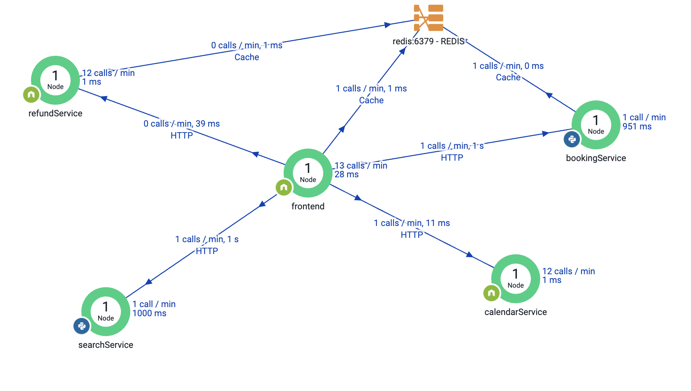

# fso-healthcare-demoapp
FSO Demo Healthcare Application

Sample demo application used for Full StackObservability demo in Cisco.
The HealthCare app is essentially a rebrand of the original titanic application. 
It allows you to book a visit with your doctor based on your needs (treatment, parcel, and so on).

## Components:
It's composed of 6 services, and each of them can be independently deployed on any K8s cluster
 - frontend (nodeJS) it's the frontend of the application
 - refund (nodeJS) allow the customer to be refunded. No question
 - calendar (nodeJS) automatically generates dates of availability
 - search (python) allows searching for doctor/treatment based on 
 - booking (predictor) (python) will write to Redis the appointment

The app is instrumented and generates analytics data. All the analytics data is generated in the frontend, so it's rapid to add/remove more analytics data.

 
 
 ## Deployment
The app can be deployed on any Kubernetes cluster.
Each service can be deployed indipendelty and exposed with a public IP adress. It is also possible to chnage the default listineing port.

Below a simple schema with default service name and listening port:
| Type                |   Service Name      | Listening Port (default).   | 
|---------------------|---------------------|-----------------------------|
| FrontEnd|frontend|80|
| Calendar|calendar|5050|
| Redis|redis|6379|
| Booking|predictor|5001|
| Refund|refund|5050|
| Search|search|5051

